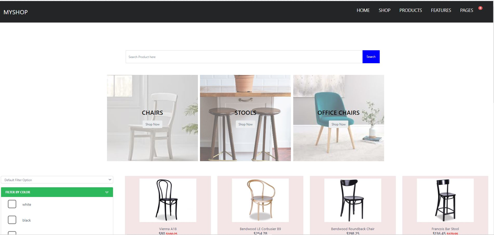

# ONLINE STORE

To demonstrate my professional experience, I have developed a online store where user can do
following activities

- we can add items to cart
- view the cart items and edit items(add or remove items from the cart)
- filter products / search for specific products
- fill the customer details and choose the payment method to complete the order
- customer will see the order confirmation page

I have developed this fully responsive application using React(front end) and Laravel 8(backend)

### IMAGES

### View Product to add to Card

### View Card to add 

### View Checkout to add 

### View Invoice

